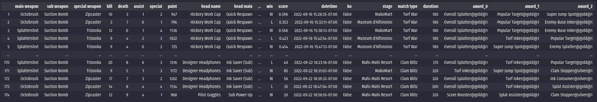
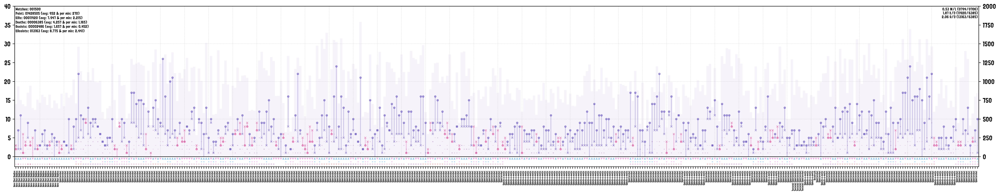
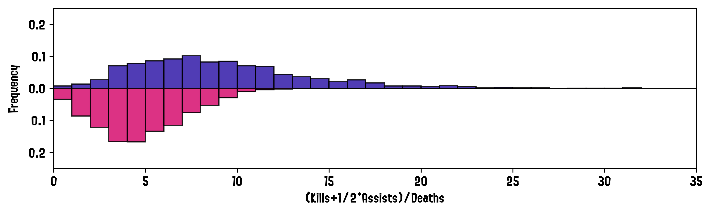
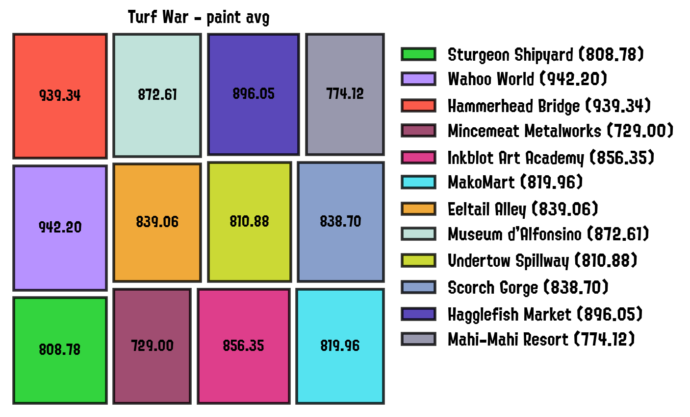
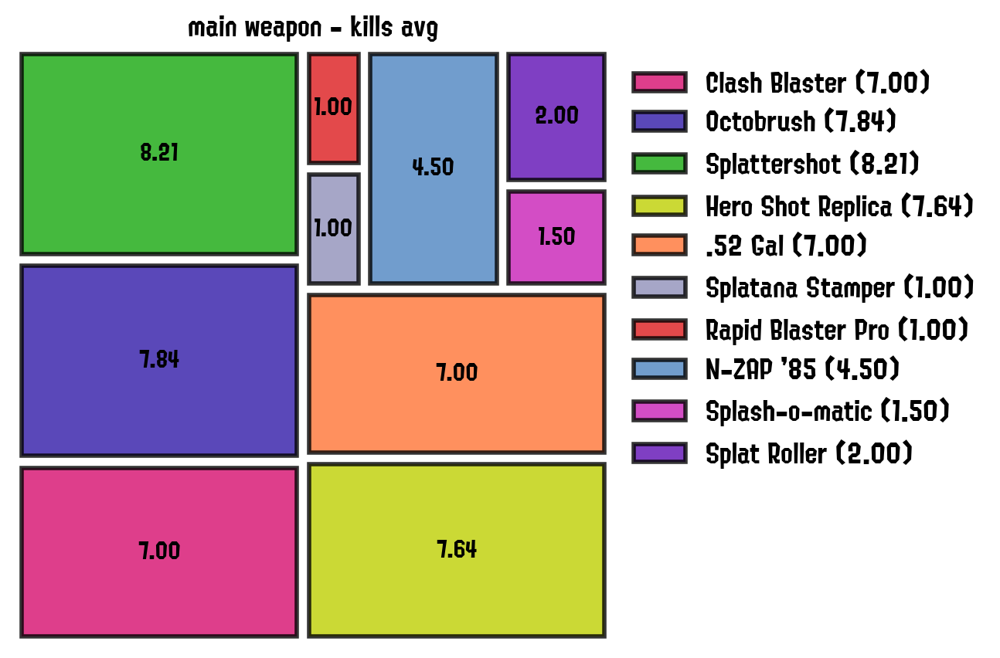
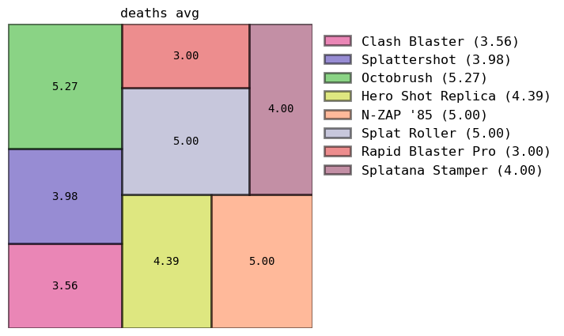
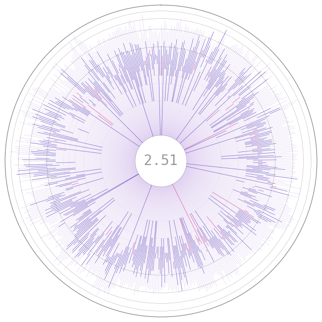
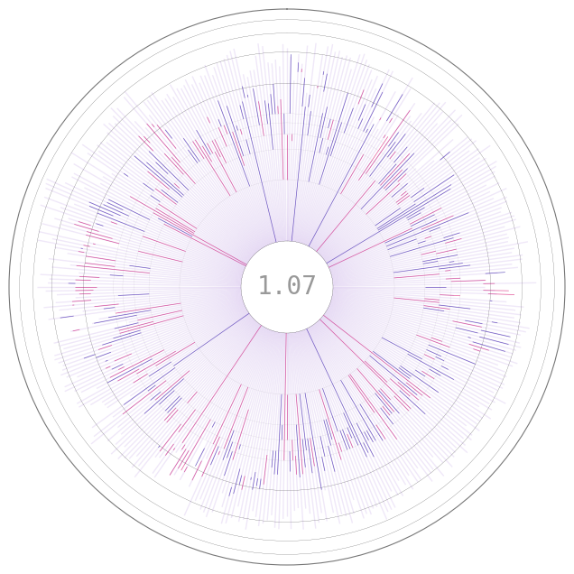
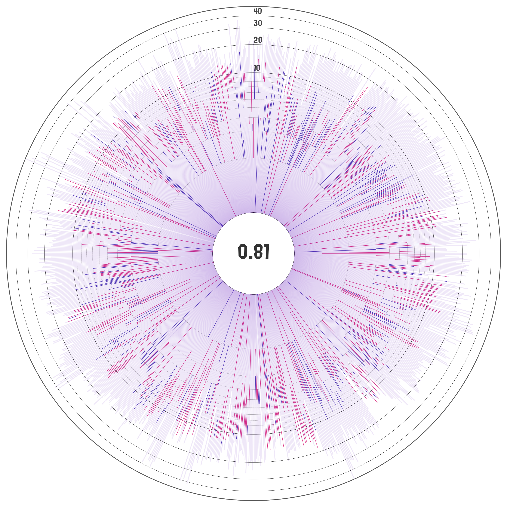
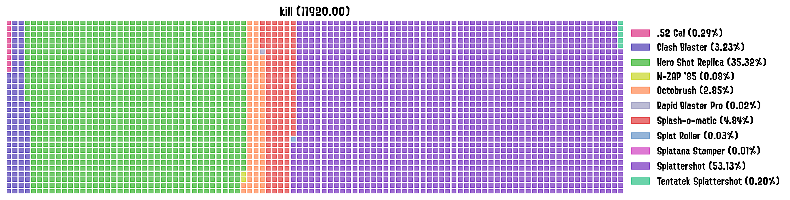

# SplatStats

**UNDER DEVELOPMENT** 

This codebase works in tandem with the [s3s package](https://github.com/frozenpandaman/s3s) to refactor and analayze [Splatoon 3](https://en.wikipedia.org/wiki/Splatoon_3)'s data. When finished, it will be able to load [s3s package](https://github.com/frozenpandaman/s3s) `json` files, re-shape them, and visualize the data from battles history.

Have a look at our [documentation](https://chipdelmal.github.io/SplatStats/) for more information on how to install and use this package!

## [Matches History Panel](https://chipdelmal.github.io/SplatStats/build/html/plots.html#matches-history-panel)

This panel is constructed as a panel composed of two different figures. The top one is a detailed breakdown of the statistics of each battle. Each column on the x axis represents a single battle; where the left y axis shows the number of kills, deaths, assists and specials; and the right y axis the turf painted over the match (bars on the plot).

## [Kills VS Deaths Distributions](https://chipdelmal.github.io/SplatStats/build/html/plots.html#matches-history-panel)

These paired histograms show the frequency distributions of the number of kills or kassists (top, blue), and the number of deaths (bottom, magenta) across matches.

## [Stage/Weapons Stats Treemaps](https://chipdelmal.github.io/SplatStats/build/html/plots.html#stats-treemaps)

These plots are designed to show which stages are the ones in which the player performs best on any given stage with respect to a selected metric. Auxiliary provided functions generate the statistics dataframe required for these plots, which includes: kills, deaths, win ratio, paint, total matches; amongst many others. These statistics can be also generated for a specific match type (Rainmaker, Turf War, Tower Control, etc), or for a combination of them.

<!--  -->

Moreover, these plots can be generated for any arbitrary key in the dataframe: main weapon, sub weapon, head gear, etc.

## [Kill/Death Iris](https://chipdelmal.github.io/SplatStats/build/html/plots.html#kill-to-deaths-iris)

Similar to the [matches history panel](https://chipdelmal.github.io/SplatStats/build/html/plots.html#matches-history-panel), these plots show the kill to death ratios as bars but this time they are arranged in a circular pattern to keep it more compact. The radial axis is log-scaled by default with the kill+assist to deaths ratio highlighted at the center of the plot.

## Coming Soon!

 

# Author

I'll be writing a [blogpost on my website](http://chipdelmal.github.io) with more information about the development, planned features, and some analyses on my own Splatoon matches data!

[Héctor M. Sánchez C.](http://chipdelmal.github.io)
