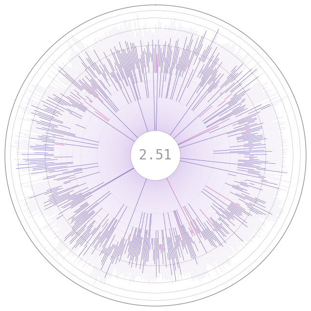

SplatStats' docs!
======================================

This python package was created to analyze personal `Splatoon 3 <https://en.wikipedia.org/wiki/Splatoon_3>`_ online matches data.
It does this by reading JSON files downloaded by the `s3s package <https://github.com/frozenpandaman/s3s>`_, converting the most useful information into dataframes, and more manageable structures for data analysis. 
`SplatStats <https://pypi.org/project/SplatStats/>`_ can also generate `plots <./plots.html>`_ that summarize information about the history of your matches and stats.

.. image:: ../img/bHistory.png
  :width: 100%

Have a look at our `quickstart guide <./quickstart.html>`_ for setup instructions and some of the basics on how to use our package! 
You can also run our package through our `docker image <./docker.html>`_ or run our our `demo <https://github.com/Chipdelmal/SplatStats/tree/main/SplatStats/demos>`_  for some example data and plots.

.. image:: https://chipdelmal.github.io/media/splatstats/BarsWin.png
  :width: 100%

Additionally, we have the hex codes for all the Splatoon `colors <./colors.html>`_ as detailed in the `Inkipedia <https://splatoonwiki.org/wiki/Ink>`_.

.. image:: https://chipdelmal.github.io/media/splatstats/RankFull.png
  :width: 29%

.. image:: file:///home/chipdelmal/Documents/GitHub/SplatStats/docs/build/html/_images/polarKillsA.png
  :width: 29%

Contents
----------

.. toctree::
  :maxdepth: 3

  index
  quickstart
  docker
  packageStructure
  plots
  colors

API
----------

For more information on the functions and classes, have a look at our API.

:ref:`modindex`

